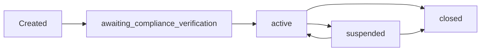

## Overview

Once an organization is created, you can manage its lifecycle, update information, and integrate it with other Bloque services like accounts and compliance.

## Organization Lifecycle

Organizations progress through different statuses:



### Status Descriptions

| Status | Description | Can Create Accounts? |
|--------|-------------|---------------------|
| `awaiting_compliance_verification` | Pending KYB verification | Limited |
| `active` | Verified and operational | Yes |
| `suspended` | Temporarily suspended | No |
| `closed` | Permanently closed | No |

## Using Organization URN

The organization URN is the unique identifier used throughout the Bloque platform:

```typescript
const org = await bloque.orgs.create(orgParams);

// Use URN for account creation
const account = await bloque.accounts.virtual.create({
  holderUrn: org.urn,  // Organization as account holder
  currency: 'USD'
});

// Use URN for compliance verification
const verification = await bloque.compliance.kyb.startVerification({
  urn: org.urn
});
```

## Managing Organization Accounts

### Create Virtual Account for Organization

```typescript
const virtualAccount = await bloque.accounts.virtual.create({
  holderUrn: organization.urn,
  currency: 'USD',
  metadata: {
    purpose: 'Operating Account',
    department: 'Finance'
  }
});

console.log('Account created:', virtualAccount.urn);
```

### Create Card Account for Organization

```typescript
const cardAccount = await bloque.accounts.card.create({
  holderUrn: organization.urn,
  currency: 'USD',
  metadata: {
    purpose: 'Corporate Card',
    cardholderName: 'Acme Corporation'
  }
});

console.log('Card account:', cardAccount.urn);
```

### Create Multiple Accounts

```typescript
// Operating account
const operating = await bloque.accounts.virtual.create({
  holderUrn: org.urn,
  currency: 'USD',
  metadata: { purpose: 'Operating' }
});

// Payroll account
const payroll = await bloque.accounts.virtual.create({
  holderUrn: org.urn,
  currency: 'USD',
  metadata: { purpose: 'Payroll' }
});

// Expense account
const expenses = await bloque.accounts.virtual.create({
  holderUrn: org.urn,
  currency: 'USD',
  metadata: { purpose: 'Expenses' }
});

console.log('Created 3 accounts for organization');
```

## Multi-Location Management

Organizations with multiple locations can manage them through the places array:

### Organization with Headquarters and Branches

```typescript
const retailChain = await bloque.orgs.create({
  org_type: 'business',
  profile: {
    legal_name: 'Retail Chain Inc',
    tax_id: '12-3456789',
    incorporation_date: '2015-01-01',
    business_type: 'Corporation',
    incorporation_country_code: 'US',
    address_line1: '1000 HQ Plaza',
    city: 'Chicago',
    postal_code: '60601',
    places: [
      {
        country_code: 'US',
        state: 'IL',
        address_line1: '1000 HQ Plaza',
        city: 'Chicago',
        postal_code: '60601',
        is_primary: true
      },
      {
        country_code: 'US',
        state: 'NY',
        address_line1: '500 Broadway',
        city: 'New York',
        postal_code: '10012',
        is_primary: false
      },
      {
        country_code: 'US',
        state: 'CA',
        address_line1: '100 Market St',
        city: 'Los Angeles',
        postal_code: '90001',
        is_primary: false
      }
    ]
  },
  metadata: {
    locationCount: 3,
    industry: 'Retail'
  }
});
```

## Organization Metadata Strategies

Use metadata to track organization-specific information:

### Example: SaaS Platform

```typescript
const org = await bloque.orgs.create({
  org_type: 'business',
  profile: orgProfile,
  metadata: {
    // Subscription info
    subscriptionTier: 'enterprise',
    subscriptionStartDate: '2024-01-01',
    monthlyFee: 999,
    
    // Usage tracking
    apiCallsThisMonth: 0,
    storageUsedGB: 50,
    
    // Account management
    accountManagerId: 'emp_12345',
    accountManagerEmail: 'manager@saas.com',
    
    // Custom identifiers
    externalOrgId: 'org_external_123',
    salesforceId: 'sf_abc123'
  }
});
```

### Example: Marketplace Platform

```typescript
const seller = await bloque.orgs.create({
  org_type: 'business',
  profile: orgProfile,
  metadata: {
    // Seller information
    storeName: 'Premium Goods Shop',
    storeUrl: 'https://marketplace.com/shop/premium-goods',
    sellerRating: 4.8,
    totalSales: 15000,
    
    // Verification status
    identityVerified: true,
    businessVerified: true,
    verificationDate: '2024-01-15',
    
    // Categories
    categories: ['electronics', 'accessories'],
    
    // Financial
    defaultPayoutAccount: 'acct_12345',
    payoutSchedule: 'weekly'
  }
});
```

### Example: Financial Services

```typescript
const financialOrg = await bloque.orgs.create({
  org_type: 'business',
  profile: orgProfile,
  metadata: {
    // Regulatory
    licenseNumber: 'FIN-2024-12345',
    regulatedBy: 'SEC',
    complianceOfficer: 'Jane Smith',
    
    // Risk assessment
    riskLevel: 'medium',
    lastRiskAssessment: '2024-01-01',
    
    // Limits
    dailyTransactionLimit: 1000000,
    monthlyVolumeLimit: 10000000,
    
    // AML/KYC
    kybStatus: 'approved',
    kybCompletedAt: '2024-01-10'
  }
});
```

## Organization Status Checks

Always verify organization status before operations:

```typescript
function canCreateAccount(org: Organization): boolean {
  return org.status === 'active';
}

function canProcessPayment(org: Organization): boolean {
  return org.status === 'active' || 
         org.status === 'awaiting_compliance_verification';
}

function isOperational(org: Organization): boolean {
  return org.status !== 'closed' && org.status !== 'suspended';
}

// Usage
if (canCreateAccount(organization)) {
  const account = await bloque.accounts.virtual.create({
    holderUrn: organization.urn,
    currency: 'USD'
  });
}
```

## Working with Organization Profiles

### Accessing Profile Information

```typescript
const org = await bloque.orgs.create(orgParams);

// Access profile fields
console.log('Legal Name:', org.profile.legal_name);
console.log('Tax ID:', org.profile.tax_id);
console.log('Incorporation Date:', org.profile.incorporation_date);
console.log('Business Type:', org.profile.business_type);
console.log('Address:', org.profile.address_line1);

// Check for logo
if (org.profile.logo_url) {
  console.log('Logo URL:', org.profile.logo_url);
}

// Check for additional locations
if (org.profile.places && org.profile.places.length > 0) {
  console.log('Number of locations:', org.profile.places.length);
  
  const primaryLocation = org.profile.places.find(p => p.is_primary);
  console.log('Primary location:', primaryLocation?.city);
}
```

## Integration Examples

### Complete Onboarding Flow

```typescript
async function onboardOrganization(businessData: any) {
  // 1. Create organization
  const org = await bloque.orgs.create({
    org_type: 'business',
    profile: {
      legal_name: businessData.legalName,
      tax_id: businessData.taxId,
      incorporation_date: businessData.incorporationDate,
      business_type: businessData.businessType,
      incorporation_country_code: businessData.countryCode,
      address_line1: businessData.address,
      city: businessData.city,
      postal_code: businessData.postalCode
    },
    metadata: {
      onboardedBy: businessData.userId,
      onboardedAt: new Date().toISOString(),
      source: 'web_application'
    }
  });

  console.log('Organization created:', org.urn);

  // 2. Start KYB verification (when available)
  // const verification = await bloque.compliance.kyb.startVerification({
  //   urn: org.urn,
  //   webhookUrl: 'https://api.example.com/webhooks/kyb'
  // });

  // 3. Create initial account
  const account = await bloque.accounts.virtual.create({
    holderUrn: org.urn,
    currency: 'USD',
    metadata: {
      purpose: 'Primary Operating Account',
      createdDuring: 'onboarding'
    }
  });

  console.log('Account created:', account.urn);

  return {
    organization: org,
    account: account
  };
}
```

### Multi-Currency Setup

```typescript
async function setupMultiCurrencyAccounts(orgUrn: string) {
  const currencies = ['USD', 'EUR', 'GBP', 'MXN'];
  
  const accounts = await Promise.all(
    currencies.map(currency =>
      bloque.accounts.virtual.create({
        holderUrn: orgUrn,
        currency: currency,
        metadata: {
          purpose: `${currency} Operating Account`,
          autoCreated: true
        }
      })
    )
  );

  console.log(`Created ${accounts.length} currency accounts`);
  return accounts;
}
```

## Best Practices

<AccordionGroup>
  <Accordion title="Verify Status Before Operations">
    Always check organization status before performing critical operations:
    
    ```typescript
    if (org.status !== 'active') {
      throw new Error(`Organization is ${org.status}, cannot proceed`);
    }
    ```
  </Accordion>

  <Accordion title="Use Metadata for Application State">
    Store application-specific data in metadata rather than separate databases:
    
    ```typescript
    metadata: {
      subscriptionId: 'sub_123',
      customerId: 'cust_456',
      features: ['api_access', 'priority_support']
    }
    ```
  </Accordion>

  <Accordion title="Track Primary Location">
    When using multiple locations, always designate one as primary:
    
    ```typescript
    places: [
      { ...location1, is_primary: true },
      { ...location2, is_primary: false }
    ]
    ```
  </Accordion>

  <Accordion title="Maintain Accurate URN References">
    Store organization URNs in your database to avoid repeated lookups:
    
    ```typescript
    // In your database
    {
      userId: '12345',
      bloqueOrgUrn: 'urn:bloque:org:abc123',
      createdAt: '2024-01-01'
    }
    ```
  </Accordion>
</AccordionGroup>

<Warning>
  Organization URNs are permanent. Never hardcode them in your application code - always retrieve them from your database or the API.
</Warning>

<Info>
  Metadata is limited to JSON-serializable values. Avoid storing functions, dates (use ISO strings), or circular references.
</Info>

## Error Handling

```typescript
import { 
  BloqueValidationError,
  BloqueNotFoundError,
  BloqueAuthenticationError 
} from '@bloque/sdk-core';

try {
  const account = await bloque.accounts.virtual.create({
    holderUrn: organization.urn,
    currency: 'USD'
  });
} catch (error) {
  if (error instanceof BloqueValidationError) {
    console.error('Invalid parameters:', error.message);
  } else if (error instanceof BloqueNotFoundError) {
    console.error('Organization not found:', error.message);
  } else if (error instanceof BloqueAuthenticationError) {
    console.error('Authentication failed:', error.message);
  }
}
```

## Related Resources

<CardGroup cols={2}>
  <Card title="Organizations Overview" icon="building" href="/organizations/overview">
    Learn about creating organizations
  </Card>
  <Card title="Virtual Accounts" icon="wallet" href="/accounts/virtual">
    Create virtual accounts for organizations
  </Card>
  <Card title="Compliance" icon="clipboard-check" href="/compliance/kyc">
    KYB verification for organizations
  </Card>
</CardGroup>